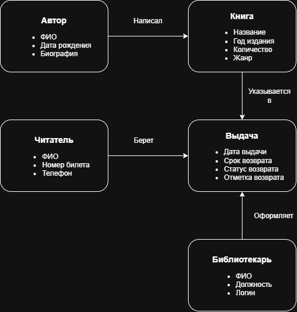

# Лабораторная работа №1
## Анализ предметной области информационной системы

## 1. Описание предметной области
Вариант 2. Система учета книг библиотеки:
Система предназначена для автоматизации работы библиотеки. Необходимо учитывать книги, авторов, читателей и выдачу книг. Библиотекарь должен иметь возможность регистрировать выдачу и возврат книг, а читатель — просматривать доступные книги и информацию о своих выдачах.

Работа посвящена созданию простой системы для автоматизации библиотеки. В программе будут учитываться сами книги, их авторы, зарегистрированные читатели, а также информация о том, кому и когда выдавались книги. Система должна помочь библиотекарю вести учет, а читателям - быстро находить нужную литературу.

---

## 2. Проблема и цель системы

* **Проблема:** Сейчас учет книг и записей о выдаче ведется вручную или на бумаге. Из-за этого легко потерять информацию о том, у кого находится книга, а также сложно найти свободный экземпляр и тяжело следить за тем, кто вовремя не вернул книги.
  
* **Цель:** Сделать удобную веб-программу, которая позволит вести понятный учет книг, хранить список читателей и автоматически отслеживать, кому и на какой срок выданы книги.
  
* **Область применения:** Школьные, университетские и обычные городские библиотеки.
  
---

## 3. Анализ предметной области

### Основные объекты предметной области

1. **Книга**
   * Назначение: Хранение информации о конкретной книге.
   * Характеристики: Название, год издания, количество доступных штук, жанр.
2. **Автор**
   * Назначение: Данные о писателях.
   * Характеристики: ФИО автора, дата рождения, краткое описание.
3. **Читатель**
   * Назначение: Учет людей, которые берут книги.
   * Характеристики: ФИО читателя, номер читательского билета, телефон.
4. **Выдача книги**
   * Назначение: Запись о том, что книга была взята читателем.
   * Характеристики: Дата выдачи, когда нужно вернуть, и отметка возврата книги.
5. **Библиотекарь**
   * Назначение: Сотрудник библиотеки, который работает в системе.
   * Характеристики: ФИО, должность, логин и пароль для входа.

### Связи между объектами

* Книга - Автор: У книги может быть один или несколько Авторов.
* Читатель - Выдача: Читатель может взять сразу несколько книг (несколько Выдач).
* Книга - Выдача: Одну и ту же книгу в разное время могут брать разные Читатели.
* Библиотекарь - Выдача: Библиотекарь оформляет и отмечает каждую Выдачу.
  
---

## 4. Пользователи и роли
| Роль | Назначение | Основные действия |
| :--- | :--- | :--- |
| **Читатель** | Ищет книги и смотрит свои долги | Поиск книг по названию и автору, просмотр списка книг, которые он задолжал или взял. |
| **Библиотекарь** | Работает с книгами и читателями | Выдача книг читателям, прием книг обратно, добавление новых книг и авторов в каталог, регистрация новых читателей. |
| **Администратор** | Настраивает доступ к системе | Добавление аккаунтов для новых библиотекарей, настройка прав доступа. |

---

## 5. Функциональные требования

**FR-01.** Система должна позволять пользователям входить в личный кабинет по логину и паролю.
* **FR-02.** Система должна позволять читателям искать книги по названию, автору или жанру.
* **FR-03.** Система должна показывать читателю список книг, которые сейчас находятся у него на руках, и даты возврата.
* **FR-04.** Система должна позволять библиотекарю добавлять новые книги в базу данных.
* **FR-05.** Система должна позволять библиотекарю менять информацию о книгах и авторах.
* **FR-06.** Система должна позволять библиотекарю регистрировать новых читателей.
* **FR-07.** Система должна позволять библиотекарю оформлять выдачу книги читателю с указанием даты, до которой ее нужно вернуть.
* **FR-08.** Система должна позволять библиотекарю отмечать возврат книги.
* **FR-09.** Система должна автоматически находить и показывать список просроченных книг и читателей-должников.
* **FR-10.** Система должна позволять администратору создавать и удалять аккаунты сотрудников.
    
---

## 6. Концепция информационной системы

* **Назначение:** Удобный учет книг и контроль за тем, чтобы их вовремя возвращали.
* **Основные возможности:** Поиск книг, запись выдач и возвратов, учет читателей, список должников.
* **Тип системы:** Веб-сайт (открывается через браузер).
* **Основные компоненты:**
  * **Интерфейс** (страницы сайта с формами и кнопками).
  * **Сервер** (логика программы, обрабатывающая действия пользователей).
  * **База данных** (место хранения списков книг, читателей и записей).
* **Результат использования:** Библиотекарю проще следить за книгами, они перестают теряться, а читатели могут быстро найти нужную книгу.

---

## 7. Схемы

### Диаграмма предметной области
Схема создана в сервисе `diagrams.net` и сохранена в репозитории:
* Исходник схемы: `diagrams/subject-area.drawio`
* Картинка схемы: `images/subject-area.png`

---

## 8. Вывод

В ходе первой лабораторной работы я проанализировал тему «Система учета книг библиотеки». Я определил основные проблемы ручного учета и цель создания системы, выделил 5 главных объектов (Книга, Автор, Читатель, Выдача, Библиотекарь), описал 3 роли пользователей и составил 10 функциональных требований. Предложенная концепция позволит упростить работу библиотеки.
