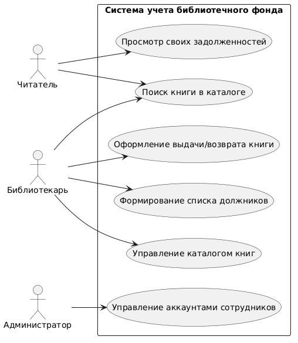
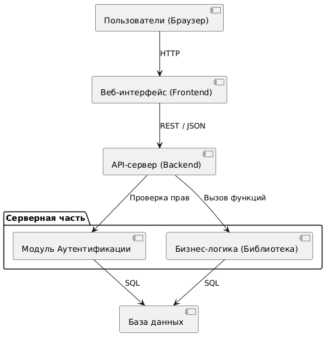

# Лабораторная работа №2
## Проектирование информационной системы

## 1. Описание предметной области
Система предназначена для автоматизации работы библиотеки. Она решает проблемы длительного поиска книг, бумажного учета выдачи литературы и сложности отслеживания должников. Система позволяет вести электронный каталог, быстро оформлять выдачу и возврат книг, а также предоставлять читателям онлайн-доступ к поиску литературы.

## 2. Пользователи и роли

| Роль | Назначение | Основные функции |
|---|---|---|
| **Читатель** | Конечный пользователь библиотеки | Поиск книг, просмотр наличия, просмотр выданных на руки книг и дат возврата. |
| **Библиотекарь** | Сотрудник, обслуживающий читателей и каталог книг | Добавление книг, регистрация читателей, оформление выдачи/возврата, поиск должников. |
| **Администратор** | Технический специалист | Создание, редактирование и удаление учетных записей библиотекарей, настройка системы. |

## 3. Сценарии использования

**Сценарий 1: Поиск книги**
* **Инициатор:** Читатель / Библиотекарь
* **Шаги:**
1. Пользователь открывает страницу каталога.
2. Вводит в строку поиска название, автора или жанр.
3. Нажимает кнопку «Найти».
4. Система обращается к базе данных и фильтрует совпадения.
5. Система выводит список найденных книг и их статус (в наличии/выдана).
* **Результат:** Пользователь видит нужную книгу и информацию о её доступности.

**Сценарий 2: Оформление выдачи книги**
* **Инициатор:** Библиотекарь
* **Шаги:**
1. Библиотекарь авторизуется в системе.
2. Переходит в раздел «Выдача книг».
3. Находит профиль читателя по ФИО или ID.
4. Выбирает нужную книгу из базы.
5. Указывает срок возврата.
6. Нажимает «Оформить выдачу».
7. Система закрепляет книгу за читателем и меняет её статус.
* **Результат:** Книга числится за читателем, дата возврата зафиксирована в системе.

**Сценарий 3: Добавление новой книги**
* **Инициатор:** Библиотекарь
* **Шаги:**
1. Переходит в раздел «Управление каталогом».
2. Нажимает кнопку «Добавить новую книгу».
3. Заполняет форму (Название, Автор, Год, Жанр, Количество экземпляров).
4. Нажимает «Сохранить».
5. Система валидирует данные и сохраняет их в базу данных.
* **Результат:** Новая книга появляется в общем поиске.

**Сценарий 4: Формирование списка должников**
* **Инициатор:** Библиотекарь
* **Шаги:**
1. Переходит в раздел «Отчеты».
2. Выбирает фильтр «Просроченные возвраты».
3. Система проверяет текущую дату и сравнивает с датами возврата выданных книг.
4. Система формирует таблицу с ФИО должников и названиями книг.
* **Результат:** На экране отображается актуальный список читателей, просрочивших возврат.

**Сценарий 5: Авторизация пользователя**
* **Инициатор:** Любая роль
* **Шаги:**
1. Пользователь открывает страницу входа.
2. Вводит логин и пароль.
3. Нажимает «Войти».
4. Система проверяет данные через модуль аутентификации.
5. При совпадении данных система генерирует сессию и перенаправляет в личный кабинет.
* **Результат:** Пользователь получает доступ к функциям согласно своей роли.

## 4. Диаграмма сценариев использования (Use Case)

**Описание:** На диаграмме представлены три актёра (Читатель, Библиотекарь, Администратор) и основные варианты их взаимодействия с системой. Читатель ограничен поиском и просмотром, библиотекарь выполняет основные бизнес-процессы, а администратор управляет доступом.

## 5. Компоненты системы

| Компонент | Назначение |
|---|---|
| **Веб-интерфейс (Frontend)** | Клиентская часть (браузер). Отвечает за отображение данных (каталога, форм) и взаимодействие с пользователем. |
| **API-сервер (Backend)** | Серверная часть. Принимает HTTP-запросы от интерфейса, обрабатывает бизнес-логику (выдачу, поиск) и отдает ответы. |
| **База данных (Database)** | Надежное хранение данных о книгах, пользователях, истории выдач и учетных записях. |
| **Модуль аутентификации** | Проверка логинов/паролей, распределение прав доступа (ролей) и защита данных. |

## 6. Диаграмма компонентов

**Описание:** Диаграмма показывает трехуровневую архитектуру. Пользователь взаимодействует с Frontend-частью, которая по REST API передает запросы Backend-серверу. Сервер содержит бизнес-логику и модуль аутентификации, которые напрямую работают с базой данных (SQL) для сохранения и извлечения информации.

## 7. Концепция информационной системы

* **Назначение и цель:** Автоматизация рутинных процессов библиотеки для ускорения обслуживания и упрощения контроля за фондом.
* **Тип системы:** Клиент-серверное веб-приложение. Работает прямо в браузере, не требует установки на компьютеры пользователей.
* **Основные возможности:** Поиск по электронному каталогу, цифровой учет выдачи и возврата, автоматическое выявление должников, разграничение прав доступа.
* **Взаимодействие компонентов:** Классическая REST-архитектура. Браузер (Frontend) отправляет запросы на сервер (Backend), который проверяет права пользователя, выполняет нужную логику и сохраняет изменения в реляционной базе данных.
